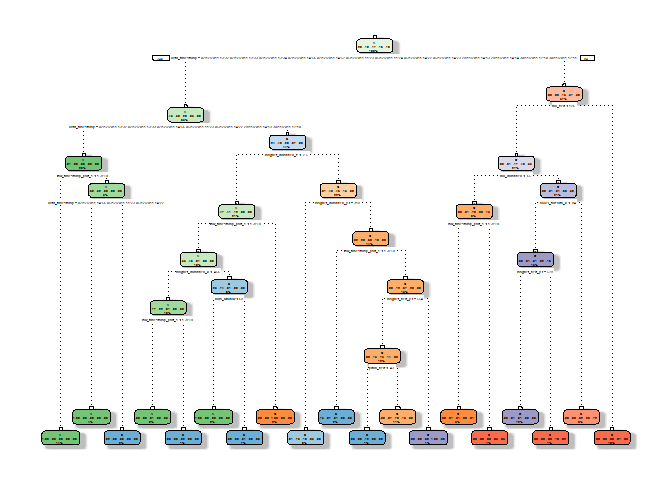

### Practical Machine Learning Assignment

Background
==========

Using devices such as Jawbone Up, Nike FuelBand, and Fitbit it is now
possible to collect a large amount of data about personal activity
relatively inexpensively. These type of devices are part of the
quantified self movement - a group of enthusiasts who take measurements
about themselves regularly to improve their health, to find patterns in
their behavior, or because they are tech geeks. One thing that people
regularly do is quantify how much of a particular activity they do, but
they rarely quantify how well they do it. In this project, your goal
will be to use data from accelerometers on the belt, forearm, arm, and
dumbell of 6 participants. They were asked to perform barbell lifts
correctly and incorrectly in 5 different ways.

Data
====

The training data for this project are available here:
<https://d396qusza40orc.cloudfront.net/predmachlearn/pml-training.csv>

The test data are available here:
<https://d396qusza40orc.cloudfront.net/predmachlearn/pml-testing.csv>

The data for this project come from this source:
<http://groupware.les.inf.puc-rio.br/har>.

Goal
====

The goal of the project is to predict the manner in which the
participants did the exercise.

Data Intake & Transformation
============================

First, we will upload the appropriate packages and set seed for
reproducability:

    library(AppliedPredictiveModeling)
    library(caret)
    library(rattle)
    library(rpart.plot)
    library(randomForest)

    set.seed(99999)

Next we import the data:

    trainDataUrl <- "http://d396qusza40orc.cloudfront.net/predmachlearn/pml-training.csv"
    testDataUrl <- "http://d396qusza40orc.cloudfront.net/predmachlearn/pml-testing.csv"

    if(!exists("trainData")){
        trainData <- read.csv(url(trainDataUrl), na.strings=c("NA","#DIV/0!",""),header=TRUE)
    }
    if(!exists("testData")){
        testData <- read.csv(url(testDataUrl), na.strings=c("NA","#DIV/0!",""),header=TRUE)
    }

    # Partitioning the Training Data into two:
    inTrain <- createDataPartition(trainData$classe, p=0.6, list=FALSE)
    trainPart <- trainData[inTrain, ]
    testPart <- trainData[-inTrain, ]
    dim(trainPart)

    ## [1] 11776   160

    dim(testPart)

    ## [1] 7846  160

    # Remove variables from Taining Data that have near Zero Variance
    NZV <- nearZeroVar(trainPart, saveMetrics=TRUE)
    trainPart <- trainPart[,NZV$nzv==FALSE]

    # Remove 1st column of training data
    trainPart <- trainPart[c(-1)]

    # Remove variables with more than 70% missing values
    trainMod <- trainPart

    for(i in 1:length(trainPart)) {
        if( sum( is.na( trainPart[, i] ) ) /nrow(trainPart) >= .7) {
            for(j in 1:length(trainMod)) {
                if( identical(names(trainPart)[i],names(trainMod)[j]))  {
                    trainMod <- trainMod[ , -j]
                }   
            } 
        }
    }
    trainPart <- trainMod
    rm(trainMod)

    # testPart should have only variables that exist in trainPart
    testPart <- testPart[colnames(trainPart)]

    # Also, testData should only have variables that exist in trainPart MINUS 'classe'
    testData <- testData[colnames(trainPart[, 1:length(trainPart)-1])]  

    # Coerce the data into the same type between trainPart and testData
    for (i in 1:length(testData) ) {
        for(j in 1:length(trainPart)) {
            if( length( grep(names(trainPart[i]), names(testData)[j]) ) == 1)  {
                class(testData[j]) <- class(trainPart[i])
            }      
        }      
    }

    # To get the same class between testing and myTraining
    testData <- rbind(trainPart[2, -58] , testData)
    testData <- testData[-1,]

ANALYSIS
========

#### Prediction with Decision Trees

    set.seed(99999)
    modFitDT <- rpart(classe ~ ., data=trainPart, method="class")
    fancyRpartPlot(modFitDT, sub="")

    predictions <- predict(modFitDT, testPart, type = "class")
    cm <- confusionMatrix(predictions, testPart$classe)
    print(cm, digits=4)

    ## Confusion Matrix and Statistics
    ## 
    ##           Reference
    ## Prediction    A    B    C    D    E
    ##          A 2148   61   10    4    0
    ##          B   81 1405  143   19    0
    ##          C    3   44 1190  167    3
    ##          D    0    8   14  881   88
    ##          E    0    0   11  215 1351
    ## 
    ## Overall Statistics
    ##                                           
    ##                Accuracy : 0.889           
    ##                  95% CI : (0.8818, 0.8959)
    ##     No Information Rate : 0.2845          
    ##     P-Value [Acc > NIR] : < 2.2e-16       
    ##                                           
    ##                   Kappa : 0.8595          
    ##  Mcnemar's Test P-Value : NA              
    ## 
    ## Statistics by Class:
    ## 
    ##                      Class: A Class: B Class: C Class: D Class: E
    ## Sensitivity            0.9624   0.9256   0.8699   0.6851   0.9369
    ## Specificity            0.9866   0.9616   0.9665   0.9832   0.9647
    ## Pos Pred Value         0.9663   0.8525   0.8458   0.8890   0.8567
    ## Neg Pred Value         0.9851   0.9818   0.9724   0.9409   0.9855
    ## Prevalence             0.2845   0.1935   0.1744   0.1639   0.1838
    ## Detection Rate         0.2738   0.1791   0.1517   0.1123   0.1722
    ## Detection Prevalence   0.2833   0.2100   0.1793   0.1263   0.2010
    ## Balanced Accuracy      0.9745   0.9436   0.9182   0.8342   0.9508

    plot(cm$table, col = cm$byClass, main = paste("Decision Tree Accuracy =", round(cm$overall['Accuracy'], 4)))

#### Prediction with Random Forest

    set.seed(99999)
    modFitRF <- randomForest(classe ~ ., data=trainPart)
    predictions <- predict(modFitRF, testPart, type = "class")
    cm <- confusionMatrix(predictions, testPart$classe)
    print(cm, digits=4)

    ## Confusion Matrix and Statistics
    ## 
    ##           Reference
    ## Prediction    A    B    C    D    E
    ##          A 2231    1    0    0    0
    ##          B    1 1517    1    0    0
    ##          C    0    0 1367    3    0
    ##          D    0    0    0 1282    0
    ##          E    0    0    0    1 1442
    ## 
    ## Overall Statistics
    ##                                           
    ##                Accuracy : 0.9991          
    ##                  95% CI : (0.9982, 0.9996)
    ##     No Information Rate : 0.2845          
    ##     P-Value [Acc > NIR] : < 2.2e-16       
    ##                                           
    ##                   Kappa : 0.9989          
    ##  Mcnemar's Test P-Value : NA              
    ## 
    ## Statistics by Class:
    ## 
    ##                      Class: A Class: B Class: C Class: D Class: E
    ## Sensitivity            0.9996   0.9993   0.9993   0.9969   1.0000
    ## Specificity            0.9998   0.9997   0.9995   1.0000   0.9998
    ## Pos Pred Value         0.9996   0.9987   0.9978   1.0000   0.9993
    ## Neg Pred Value         0.9998   0.9998   0.9998   0.9994   1.0000
    ## Prevalence             0.2845   0.1935   0.1744   0.1639   0.1838
    ## Detection Rate         0.2843   0.1933   0.1742   0.1634   0.1838
    ## Detection Prevalence   0.2845   0.1936   0.1746   0.1634   0.1839
    ## Balanced Accuracy      0.9997   0.9995   0.9994   0.9984   0.9999

    plot(modFitRF)

    plot(cm$table, col = cm$byClass, main = paste("Random Forest Accuracy =", round(cm$overall['Accuracy'], 4)))

#### Prediction with Generalized Boosted Regression

    set.seed(99999)
    fitControl <- trainControl(method = "repeatedcv",number = 5,repeats = 1)
    modFitGBM <- train(classe ~ ., data=trainPart, method = "gbm",trControl = fitControl, verbose = FALSE)

    predictions <- predict(modFitGBM, newdata=testPart)
    cm <- confusionMatrix(predictions, testPart$classe)
    print(cm, digits=4)

    ## Confusion Matrix and Statistics
    ## 
    ##           Reference
    ## Prediction    A    B    C    D    E
    ##          A 2231    2    0    0    0
    ##          B    1 1512    1    0    0
    ##          C    0    3 1355    4    0
    ##          D    0    1   12 1279    1
    ##          E    0    0    0    3 1441
    ## 
    ## Overall Statistics
    ##                                           
    ##                Accuracy : 0.9964          
    ##                  95% CI : (0.9948, 0.9976)
    ##     No Information Rate : 0.2845          
    ##     P-Value [Acc > NIR] : < 2.2e-16       
    ##                                           
    ##                   Kappa : 0.9955          
    ##  Mcnemar's Test P-Value : NA              
    ## 
    ## Statistics by Class:
    ## 
    ##                      Class: A Class: B Class: C Class: D Class: E
    ## Sensitivity            0.9996   0.9960   0.9905   0.9946   0.9993
    ## Specificity            0.9996   0.9997   0.9989   0.9979   0.9995
    ## Pos Pred Value         0.9991   0.9987   0.9949   0.9892   0.9979
    ## Neg Pred Value         0.9998   0.9991   0.9980   0.9989   0.9998
    ## Prevalence             0.2845   0.1935   0.1744   0.1639   0.1838
    ## Detection Rate         0.2843   0.1927   0.1727   0.1630   0.1837
    ## Detection Prevalence   0.2846   0.1930   0.1736   0.1648   0.1840
    ## Balanced Accuracy      0.9996   0.9979   0.9947   0.9962   0.9994

    plot(modFitGBM, ylim=c(0.9, 1))

Conclusion
==========

Among the above four methods, **Random Forest** appears to give the
highest prediction accuracy of 99.91%.

The expected out-of-sample error is 100-99.91 = 0.09%.

#### Predictions with Test Data

    predictions <- predict(modFitRF, testData, type = "class")
    predictions

    ##  1  2 31  4  5  6  7  8  9 10 11 12 13 14 15 16 17 18 19 20 
    ##  B  A  B  A  A  E  D  B  A  A  B  C  B  A  E  E  A  B  B  B 
    ## Levels: A B C D E
